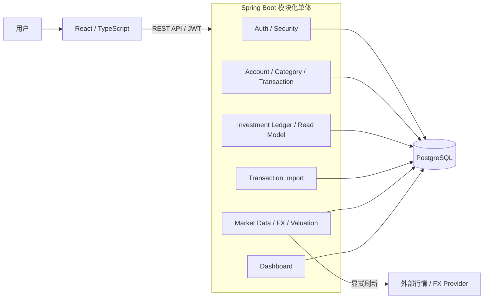

# Personal Finance OS

[](https://github.com/qianlixunbai/Personal-Finance-OS/actions/workflows/ci.yml)


Personal Finance OS 是一个以 Java 21、Spring Boot、PostgreSQL 和 React 构建的个人财务管理系统。它以服务端为金融计算与审计权威，覆盖账户、普通流水、参考估值、不可变投资账本和普通流水文件导入。

系统用于记录、校验、汇总和追溯用户维护的财务事实，不执行真实支付、资金划转或证券交易，也不提供投资建议。

> 当前阶段、验收状态和未完成范围以 [项目状态](docs/STATUS.md) 为唯一来源。

## 项目截图与 Demo

[在线体验静态 Demo](https://personal-finance-os-demo.qianlixunbai.chatgpt.site/#/login)

> Demo 使用虚构数据，为独立静态只读展示，不连接本仓库后端、数据库或外部行情 Provider。

<table>
  <tr>
    <td></td>
    <td></td>
  </tr>
  <tr>
    <td></td>
    <td></td>
  </tr>
</table>

## 为什么不是普通 CRUD

### 金融事务一致性

普通流水、批量导入和投资命令都由后端控制事务边界。账户余额、业务事实、受控投影与权威回执在同一 PostgreSQL 事务中收敛；写路径使用行锁、固定锁顺序和事务级 `lock_timeout` 处理并发竞争。

### 不可变投资账本

投资原始事实不通过 `UPDATE` 或 `DELETE` 覆盖。错误交易通过 append-only reversal 或 same-type replacement 纠正，历史回执和当前 corrected truth 明确分离。

### 确定性重放

持仓数量、成本和累计已实现盈亏由规范化事实顺序重放得到。candidate replay、持久化后二次 replay、trace 与 digest 共同约束投影一致性。

### 幂等与未知结果恢复

投资命令与 Import Confirm 将幂等键绑定规范化请求摘要。同一意图可以恢复权威结果，不同意图复用同一 key 会被拒绝；并发、锁超时、unknown commit 和中途故障均有明确的 fail-closed 或回滚语义。

## 系统架构



系统采用前后端分离的模块化单体。PostgreSQL 保存财务事实、审计记录和受控投影；外部行情与 FX 仅形成参考快照，不覆盖账务真值。当前设计详见 [Current Architecture](docs/architecture/current-architecture.md)。

## 核心能力

- 注册、登录、JWT、用户数据隔离与安全 `404`；
- Account、Category、`INCOME` / `EXPENSE` / `ADJUSTMENT` 与后端余额联动；
- Dashboard 的净资产、现金流、趋势、资产分布和最近流水聚合；
- Market Quote、FX snapshot 与只读 CNY reference valuation；
- Investment Instrument、Legacy opening migration、BUY / SELL / DIVIDEND；
- standalone reversal、same-type replacement、不可变回执与审计时间线；
- Portfolio、Position、logical transaction 读取模型及投资命令/纠正 UI；
- CSV / XLSX 上传、字段映射、服务端 Preview、warning acknowledgement、原子 Confirm、恢复与权威 Receipt UI。

能力的正式验收边界见 [STATUS](docs/STATUS.md)，接口详情见 [API](docs/architecture/api.md)。

## 技术栈与边界

| 层次 | 当前技术 |
| --- | --- |
| 后端 | Java 21、Spring Boot 3.3.5、Spring Security、JWT、MyBatis-Plus |
| 数据 | PostgreSQL 17、Flyway V1–V17、Testcontainers |
| 前端 | React 19、TypeScript、Vite、ECharts、Axios |
| 文件导入 | Apache Commons CSV、Apache POI |
| 交付 | Maven Wrapper、npm、Docker Compose、GitHub Actions |

- 当前账务为 CNY 单币种，金额使用 `BigDecimal` / PostgreSQL `NUMERIC`；
- 金融计算、余额和核心聚合以后端为准，前端不建立第二套金融真值；
- 普通 `Transaction` 与不可变 `InvestmentTransaction` 是两套不同语义的事实；
- Market Quote、FX 和 reference valuation 是参考数据，不是账务事实。

## 测试与工程质量

仓库包含单元测试、WebMvc 契约测试、PostgreSQL Testcontainers 集成测试、Migration 升级测试、并发与 failure-injection 测试、前端 Node 测试和 Playwright E2E。GitHub Actions 对后端测试、前端 test/lint/build、镜像构建及 Compose 配置进行校验。

测试数字属于具体 Closing Review 的历史快照，不在 README 维护。测试策略见 [Testing](docs/engineering/testing.md)，阶段证据见 [archive/review](docs/archive/review/README.md)。

## 本地运行

准备 Java 21、Node.js 22/npm 和 PostgreSQL 17，并配置：

```powershell
$env:DB_USERNAME = "finance_os"
$env:DB_PASSWORD = "your-local-password"
$env:JWT_SECRET = "at-least-32-characters-secret"
$env:MIGRATION_PREVIEW_SECRET = "another-32-characters-secret"
$env:FINANCE_IMPORT_CONFIRM_TOKEN_SECRET = "a-third-32-characters-secret"
```

启动后端：

```powershell
cd backend
.\mvnw.cmd spring-boot:run
```

启动前端：

```powershell
cd frontend
npm install
npm run dev
```

开发环境 Swagger UI：`http://localhost:8080/swagger-ui.html`。完整配置、验证命令和当前 Docker Compose 限制见 [开发指南](docs/engineering/development.md) 与 [部署指南](docs/engineering/deployment.md)。

## 文档导航

- [项目当前状态](docs/STATUS.md)
- [产品愿景与需求](docs/product/vision.md)
- [当前架构](docs/architecture/current-architecture.md)
- [业务与金融规则](docs/domain/business-rules.md)
- [本地开发](docs/engineering/development.md)
- [完整文档地图](docs/README.md)

## 项目边界

当前系统不提供真实支付、银行转账执行、证券下单、托管、投资建议、自动交易或生产级银行/券商同步。完整范围与 Non-goals 见 [Scope and Non-goals](docs/product/scope-and-non-goals.md)。
