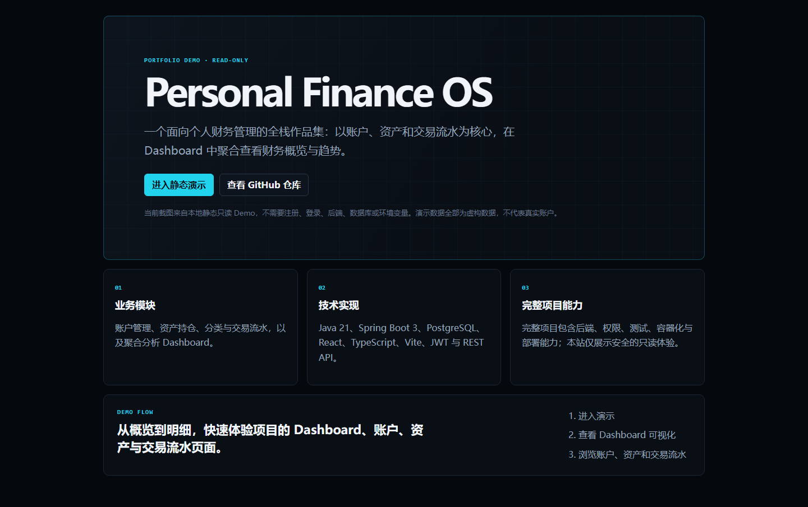
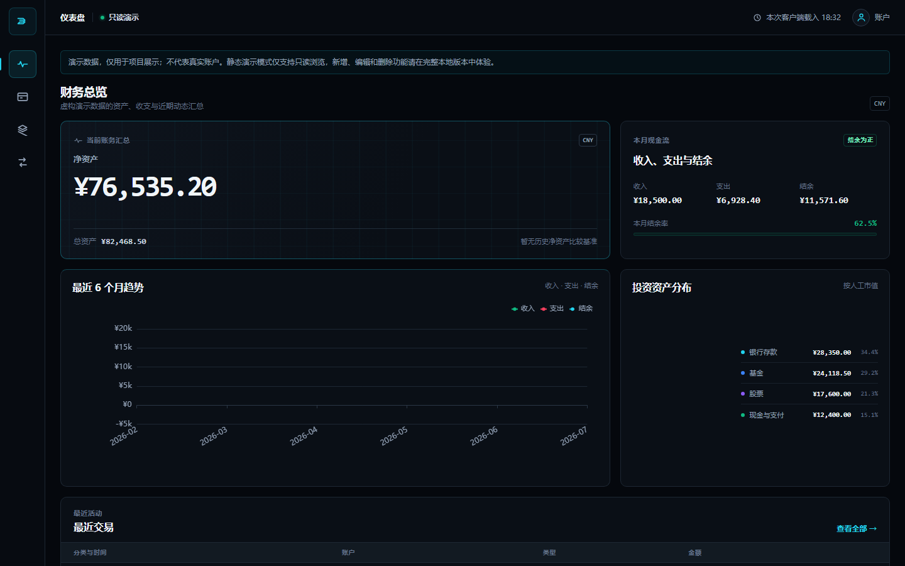
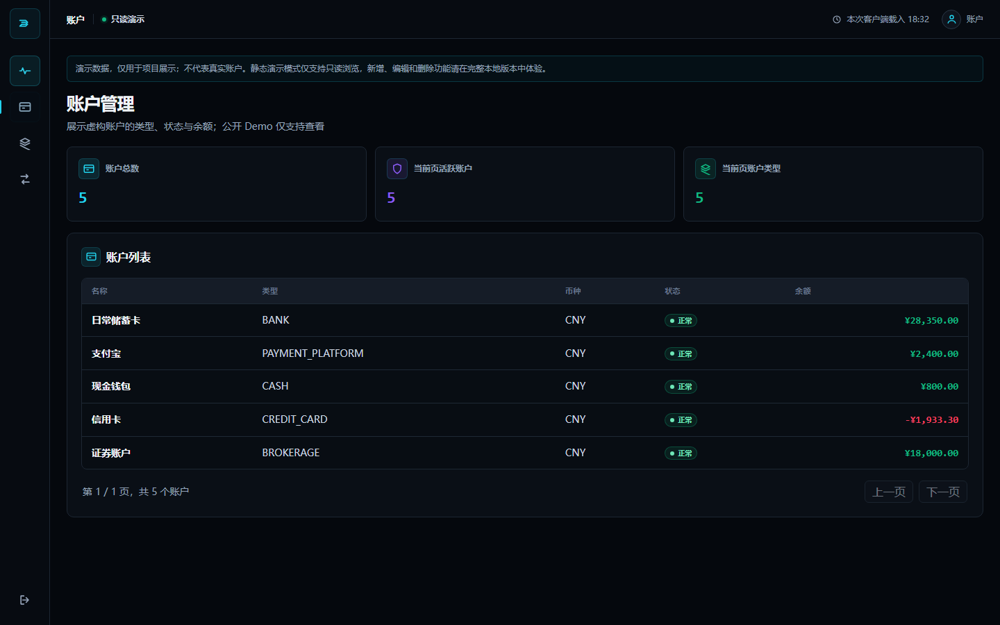
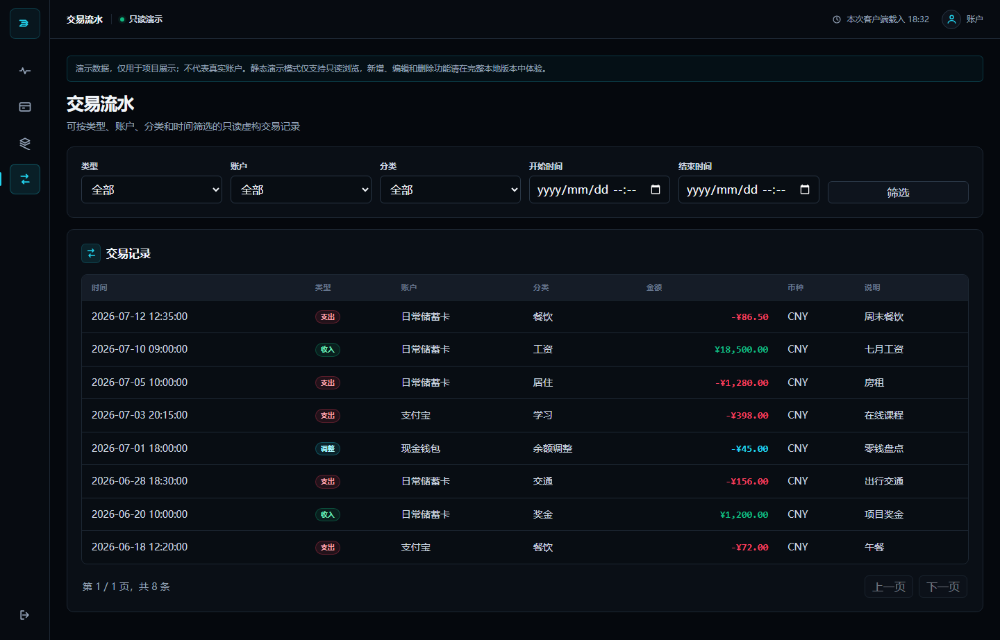
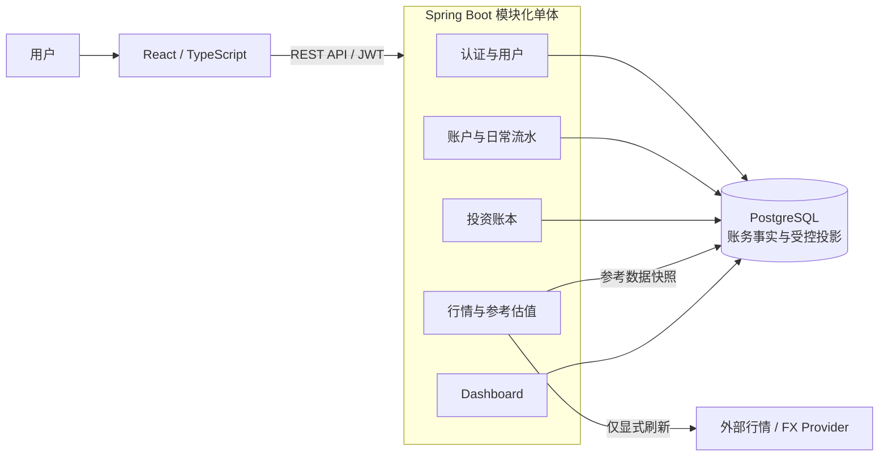
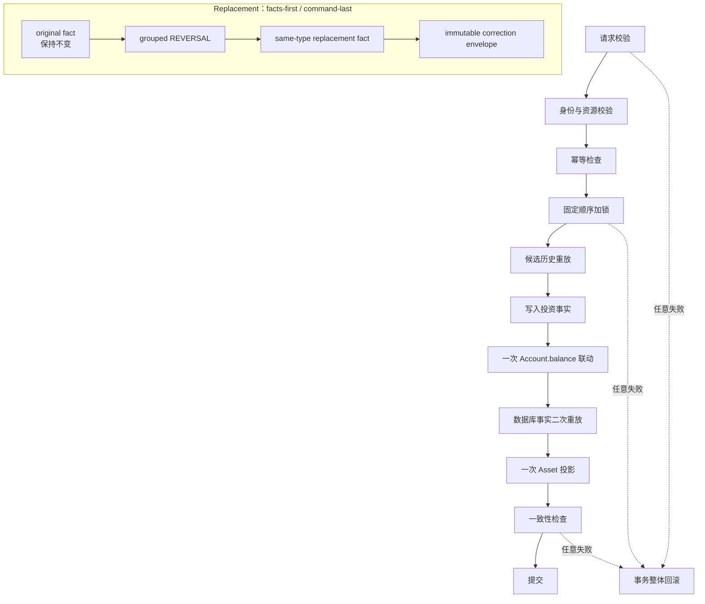

# Personal Finance OS

[](https://github.com/qianlixunbai/Personal-Finance-OS/actions/workflows/ci.yml)


> **当前阶段：** `v3.0 Phase 2C-2C Transaction & Audit Read API：CLOSED — GO`
>
> **下一阶段：** `v3.0 Phase 2C-3 Investment Read Frontend：NOT STARTED`

Personal Finance OS 是一个以 Java 21、Spring Boot 3、PostgreSQL 与 React 构建的工程化个人财务管理系统。它覆盖账户与日常收支、市场参考估值，以及具备不可变审计、确定性重放、幂等恢复和并发一致性的投资账本，因此不是普通 CRUD 示例。

系统记录和管理用户维护的财务事实，不执行真实支付、银行转账或证券交易，也不提供投资建议。

## 项目截图与 Demo

[**在线体验静态 Demo →**](https://personal-finance-os-demo.qianlixunbai.chatgpt.site/#/login)

> Demo 使用虚构数据，为静态只读展示，不连接真实后端、数据库或行情 Provider，也不代表投资账本写路径已经实现前端界面。

<table>
  <tr>
    <td></td>
    <td></td>
  </tr>
  <tr>
    <td></td>
    <td></td>
  </tr>
</table>

截图来自 `sites-demo` 的本地静态只读构建。

## 为什么不是普通 CRUD

### 金融一致性

普通流水和投资命令在数据库事务内同时维护财务事实、`Account.balance` 与受控投影。写路径使用 PostgreSQL 行锁、固定锁顺序和事务级 `lock_timeout`，降低 lost update、死锁和并发错账风险。

### 不可变投资账本

原始投资事实不通过 `UPDATE` 或 `DELETE` 覆盖。纠正采用 append-only standalone reversal，或由 grouped reversal、同类型 replacement fact 与 correction envelope 组成的原子 replacement。

### 确定性重放

持仓数量、成本与累计已实现盈亏由规范化历史顺序重放得到。replacement 使用原交易的 replay anchor；trace 与 SHA-256 digest 用于比较候选重放、数据库内二次重放和最终投影。

### 失败与重试恢复

写路径覆盖幂等键同请求回放、同 key 不同请求冲突、锁超时、deadlock、unknown commit recovery 与分阶段故障注入。任何中途失败都会回滚事实、余额、投影、回执和纠正命令。

## 系统架构



前后端分离，后端保持模块化单体。PostgreSQL 保存账务事实、投资事实和受控投影；外部 Provider 只通过显式刷新进入参考数据模块，行情和 FX 不直接修改账务真值。

## 核心投资写路径



普通 BUY / SELL / DIVIDEND 写入一个业务事实；replacement 先写两条纠正事实，完成余额与投影校验后再写 command envelope。外部命令只导致一次账户余额更新、一次 Asset 投影和一次 `projectionVersion + 1`。

## 当前核心能力

### 基础财务

- 注册、登录、JWT、用户状态和数据隔离；
- Account、Category 与 `INCOME` / `EXPENSE` / `ADJUSTMENT`；
- 后端原子维护余额，支持流水分页、筛选和安全 `404`；
- Dashboard 汇总净资产、收支、趋势、资产分布和最近交易。

### 市场参考估值

- US `STOCK` / `ETF` 参考行情，支持显式刷新、TTL 与 single-flight；
- Provider 默认关闭，并有用户级/全局限流和 stale fallback；
- FX snapshot 与 reference valuation 只读计算；
- 普通 GET 不调用 Provider，参考估值不覆盖账务或投资投影。

### 投资账本

- 用户级 Investment Instrument 与 Account / Instrument / Asset 唯一绑定；
- Legacy opening migration、first BUY、后续 BUY / SELL 与 DIVIDEND；
- 加权平均成本、全历史 replay、Position 关闭与重新打开；
- standalone reversal 与 same-type replacement correction；
- immutable receipt、request hash、幂等恢复和 append-only audit。
- Portfolio、Position 列表/详情，以及 logical transaction 列表/详情和 audit timeline 只读 API。

## 技术栈与数据边界

| 层次 | 当前技术 |
| --- | --- |
| 后端 | Java 21、Spring Boot 3.3、Spring Security、JWT、MyBatis-Plus |
| 数据 | PostgreSQL 17、Flyway V1–V13、Testcontainers |
| 前端 | React 19、TypeScript、Vite、ECharts、Axios |
| 交付 | Maven Wrapper、npm、Docker Compose、GitHub Actions |

- 金融计算和业务规则以后端为唯一权威，前端不重新聚合核心金融数据；
- 当前账务为 CNY 单币种，金额使用 `BigDecimal` / `NUMERIC`；
- Market Quote、FX、手动价格与 reference valuation 是参考数据，不是账务事实；
- `Asset` 是当前持仓投影，`InvestmentTransaction` 是不可变投资事实；
- 普通 `Transaction` 与 `InvestmentTransaction` 是两套不同语义的账本。

## 测试与工程验证

| 验证项 | Phase 2C-2C 关闭证据 |
| --- | --- |
| 后端自动化测试 | 98 suites / 540 tests |
| failures / errors | 0 / 0 |
| 数据库 | PostgreSQL 17.10 |
| Migration | Flyway V13 |
| Transaction PostgreSQL 聚焦套件 | 18/18，连续两次 |
| Closing Review | GO，P0/P1 = 0 |

以上是 Phase 2C-2C 关闭时记录的验证快照；完整命令、语义断言和环境见 [Phase 2C-2C Closing Review](docs/review/V3.0-Phase2C-2C-Closing-Review.md)。

当前 `zh-cn` 分支的 CI 会运行后端测试、前端测试/lint/build、镜像构建与 Compose 配置校验。

## 项目结构

```text
finance-os/
├── backend/       Spring Boot 模块化单体
├── frontend/      React / TypeScript / Vite
├── docker/        Docker Compose 单机部署
├── scripts/       本地开发与验证脚本
└── docs/
    ├── 03-Architecture/
    ├── ADR/
    ├── design/
    └── review/
```

详细模块、测试和文档目录见 [项目结构](docs/项目结构.md)。

## 本地运行

准备 Java 21、Node.js/npm 和 PostgreSQL 17，并配置：

```powershell
$env:DB_USERNAME = "finance_os"
$env:DB_PASSWORD = "your-local-password"
$env:JWT_SECRET = "at-least-32-characters-secret"
$env:MIGRATION_PREVIEW_SECRET = "another-32-characters-secret"
```

启动后端：

```powershell
cd backend
.\mvnw.cmd spring-boot:run
```

启动前端：

```powershell
cd frontend
npm install
npm run dev
```

本地 Swagger UI：`http://localhost:8080/swagger-ui.html`。完整环境和验证命令见 [开发指南](docs/Development-Guide.md)。

## Docker Compose

```powershell
Copy-Item docker\.env.example docker\.env
# 替换 docker\.env 中的密码和两个不同的密钥
docker compose --env-file docker/.env -f docker/compose.yml up --build -d
```

默认通过 `FRONTEND_PORT` 暴露前端；该配置是单机容器化基础，不是完整生产运维平台。详见 [部署指南](docs/Deployment-Guide.md)。

## 核心文档

- [文档中心](docs/README.md)｜[项目愿景](docs/Project%20Vision.md)｜[需求规格](docs/SRS.md)｜[路线图](docs/Roadmap.md)
- [冻结架构](docs/03-Architecture/Architecture.md)｜[数据库基线](docs/03-Architecture/Database.md)｜[API 契约](docs/03-Architecture/API.md)
- [Phase 2C-1 读取模型契约](docs/design/V3.0-Phase2C-1-Investment-Read-Model-Contract.md)｜[ADR-015](docs/ADR/ADR-015-investment-read-model-contract.md)｜[2C-2A Review](docs/review/V3.0-Phase2C-2A-Closing-Review.md)｜[2C-2B Review](docs/review/V3.0-Phase2C-2B-Closing-Review.md)｜[2C-2C Review](docs/review/V3.0-Phase2C-2C-Closing-Review.md)
- [业务规则](docs/Business%20Rules.md)｜[金融规则](docs/Financial%20Rules.md)
- [开发指南](docs/Development-Guide.md)｜[完成定义](docs/Definition%20of%20Done.md)｜[代码审查清单](docs/Code%20Review%20Checklist.md)
- [ADR](docs/ADR/)｜[阶段 Review](docs/review/)｜[项目结构](docs/项目结构.md)

## 下一阶段与未实现能力

`Phase 2C-2C Transaction & Audit Read API` 已关闭并获得 GO。Phase 2C 后端现已公开 Portfolio、Position 列表/详情、logical transaction 列表/详情与 audit timeline；默认列表返回逻辑业务事件，详情和时间线以原始事实 ID 作为 `logicalTransactionId`，不会把 correction physical fact 暴露为独立逻辑交易。

`Phase 2C-3 Investment Read Frontend` 尚未开始；投资前端和 correction UI 仍未实现。系统也没有 `TRANSFER` / `REFUND`、收益曲线、多币种账务、FIFO/lot、公司行动、银行/券商自动同步、真实交易执行、AI Agent 或原生移动端。
