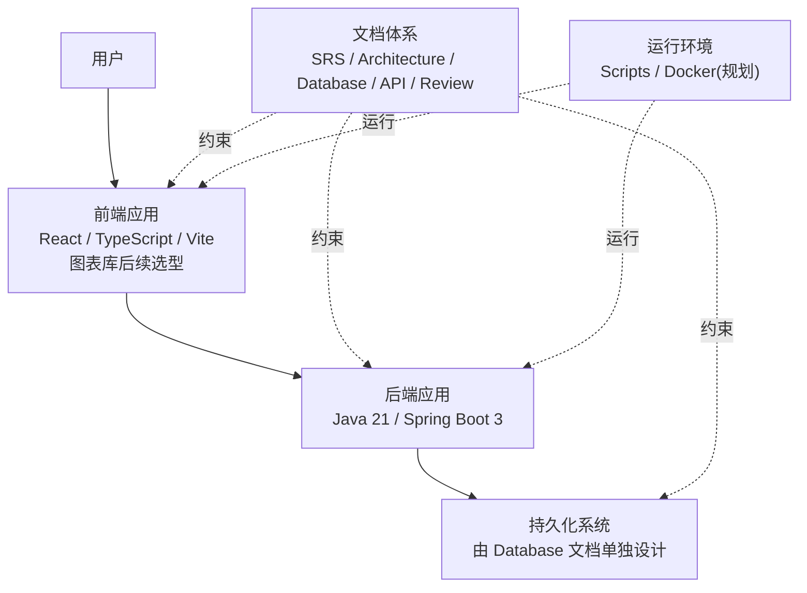
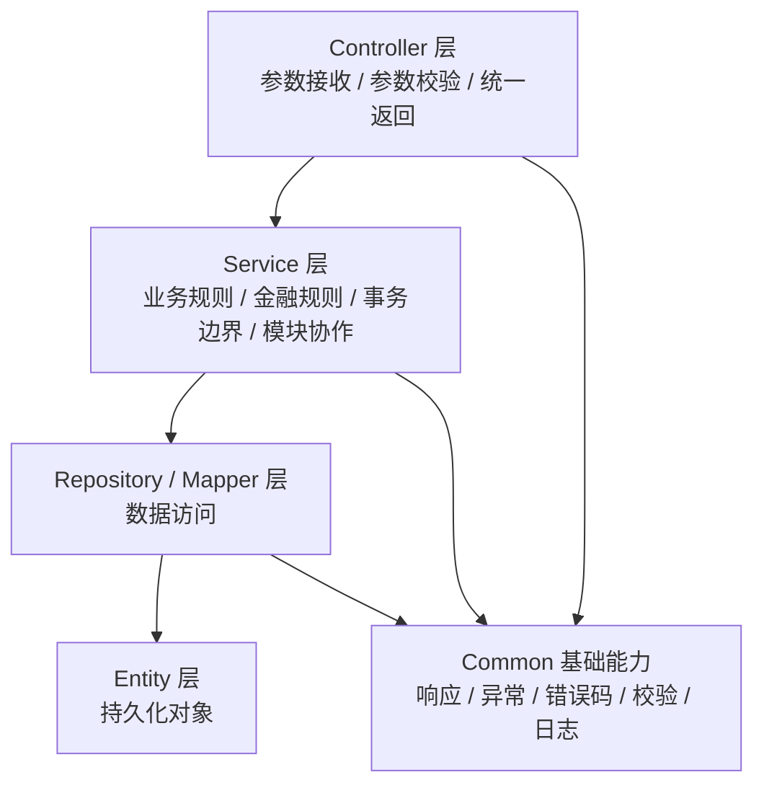
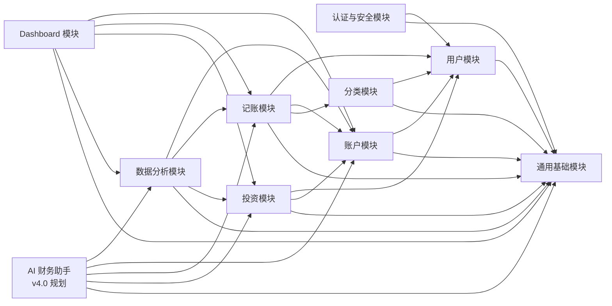

# Architecture（系统架构设计）

**项目名称：** Personal Finance OS

**版本：** v1.0

**状态：** Reviewed / Frozen

**日期：** 2026-07-06

------

# 一、文档目的

本文档定义 Personal Finance OS v1.0 Foundation 的系统架构基线，用于约束后续模块设计、数据库设计、API 设计、代码开发和测试工作。

Architecture.md 已完成 Review 并作为当前架构基线冻结。后续如需调整架构边界、核心模块拆分或关键技术选型，应通过 ADR 记录原因、影响范围和迁移策略。

本文档仅描述系统级架构、分层方式、模块边界、模块职责、模块依赖和扩展方向。

本文档不包含：

- 数据库表结构设计；
- API 接口设计；
- Java 代码实现；
- SQL 或 Migration；
- 具体业务算法实现细节。

------

# 二、架构目标

Personal Finance OS 是一个面向长期维护的个人金融管理系统。架构设计应服务于长期演进，而不是一次性快速完成功能。

## 2.1 稳定性

系统应保持清晰、稳定的核心架构。后续新增功能应优先扩展现有模块边界，而不是频繁改变系统结构。

## 2.2 可维护性

系统应采用清晰的分层与模块划分，使开发者可以快速理解每个模块的职责、边界和依赖关系。

## 2.3 可扩展性

系统应支持后续扩展多币种、行情数据、AI 分析、缓存、导入导出、插件系统和国际化等能力。

## 2.4 可测试性

系统应通过明确的分层和模块边界降低测试复杂度。业务逻辑集中在业务层，避免分散在入口层或基础设施层。

## 2.5 数据一致性

系统涉及账户、流水、资产、持仓和统计分析等金融数据，架构应优先保障数据一致性、可追溯性和边界清晰。

## 2.6 简单优先

V1.0 采用模块化单体架构，不引入微服务。系统应遵循 KISS、DRY、SOLID、Clean Architecture、高内聚、低耦合原则。

------

# 三、系统总体架构

Personal Finance OS v1.0 采用**前后端分离的模块化单体架构**。

系统整体由以下部分组成：

- 前端应用：负责用户交互、页面展示、表单提交、图表展示和状态管理；
- 后端应用：负责身份认证、业务规则、金融计算、数据访问协调和统一响应；
- 持久化系统：负责保存用户、账户、流水、分类、资产和分析所需的数据；
- 部署与运行环境：负责本地开发、容器化部署和后续运维扩展；
- 文档体系：负责约束需求、架构、数据库、API、测试、评审和迭代过程。

系统核心定位是**管理财富，而不是操作财富**。因此系统只记录、管理、分析个人财务数据，不提供银行支付、证券交易、自动下单、量化交易或金融风控能力。

------

# 四、技术架构

## 4.1 后端技术架构

后端采用 Java 21 与 Spring Boot 3 作为基础技术栈。

后端应用承担：

- 用户身份认证；
- 业务规则执行；
- 金融规则执行；
- 模块服务编排；
- 事务边界控制；
- 统一异常处理；
- 统一日志输出；
- 权限边界控制。

后端应保持模块化单体结构。各业务模块部署在同一个后端应用内，但通过清晰的包结构、服务边界和依赖规则保持模块独立。

## 4.2 前端技术架构

前端当前采用 React、TypeScript 和 Vite。图表库属于后续可视化阶段选型，当前不固定为已落地能力。

前端应用承担：

- 用户界面展示；
- 表单输入与基础校验；
- 页面状态管理；
- 图表和数据可视化；
- 用户操作入口；
- 与后端进行数据交互。

前端不承担核心金融计算，不绕过后端业务规则，不直接维护统计结果。

## 4.3 安全架构

系统采用基于 JWT 的身份认证机制。

安全架构应满足：

- 用户登录后才能访问个人数据；
- 普通用户只能访问自己的数据；
- 密码使用 BCrypt 加密；
- 禁止硬编码密钥；
- 禁止敏感信息出现在日志中；
- 所有入口参数必须经过校验。

V1.0 暂不设计管理员、多角色权限、多用户协作或家庭账本能力。

## 4.4 数据访问架构

系统通过后端数据访问层访问持久化系统。

数据访问层只负责数据读写，不承担业务判断、金融计算或跨模块编排。业务规则必须位于业务层。

本文档不设计数据库结构、字段、索引、Migration 或 SQL。

## 4.5 部署架构

系统支持后续通过 Docker 进行部署。

V1.0 的部署架构应保持简单，优先保证系统可运行、可维护、可调试。缓存、消息队列、自动同步等能力不作为 V1.0 的必要组成部分。

------

# 五、分层架构

后端采用清晰的分层架构。各层职责如下：

## 5.1 Controller 层

Controller 层是后端请求入口。

职责：

- 接收请求参数；
- 执行入口参数校验；
- 调用对应业务服务；
- 返回统一结果。

禁止：

- 编写业务逻辑；
- 编写金融计算；
- 直接访问持久化系统；
- 处理跨模块业务编排。

## 5.2 Service 层

Service 层是业务逻辑核心。

职责：

- 执行业务规则；
- 执行金融规则；
- 进行业务编排；
- 控制事务边界；
- 保证数据一致性；
- 对外提供模块能力。

Service 层是模块之间协作的主要边界。模块之间不应绕过 Service 层直接访问对方内部结构。

## 5.3 Repository / Mapper 层

Repository / Mapper 层负责数据访问。

职责：

- 执行数据读取；
- 执行数据写入；
- 封装持久化访问能力。

禁止：

- 编写业务规则；
- 编写金融计算；
- 编写跨模块业务流程。

## 5.4 Entity 层

Entity 层用于表达持久化对象。

职责：

- 描述持久化数据结构；
- 承载数据映射需要的基础信息。

禁止：

- 编写业务流程；
- 编写复杂金融计算；
- 依赖 Controller 或 Service。

## 5.5 DTO / VO 层

DTO / VO 用于隔离外部输入输出与内部对象。

职责：

- 表达请求数据；
- 表达响应数据；
- 隔离外部结构和内部结构；
- 降低模块内部变化对外部调用方的影响。

------

# 六、模块划分

当前实现与后续规划按业务能力划分以下模块：

1. 用户模块；
2. 账户模块；
3. 分类模块；
4. 记账模块；
5. 投资模块；
6. Dashboard 模块；
7. 数据分析模块；
8. AI 财务助手模块（v4.0 规划，当前未实现）；
9. 认证与安全模块；
10. 通用基础模块。

模块划分遵循以下原则：

- 一个模块只负责一个清晰业务领域；
- 模块内部高内聚；
- 模块之间低耦合；
- V1.0 模块之间优先通过公开 Service 能力协作；
- 如后续需要引入领域事件，必须先在 Module Design 或 ADR 中明确事件边界、触发场景和一致性要求；
- 禁止随意跨模块访问内部数据结构；
- 禁止为尚未进入版本规划的能力提前实现复杂架构。

------

# 七、模块职责

## 7.1 用户模块

用户模块负责个人用户的基础信息管理。

职责：

- 用户注册；
- 用户资料维护；
- 用户状态管理；
- 保证用户账号唯一性；
- 为其他模块提供当前用户归属基础。

边界：

- 不负责登录令牌生成；
- 不负责账户、流水、资产等业务数据管理；
- V1.0 不提供永久删除用户能力。

## 7.2 认证与安全模块

认证与安全模块负责登录、身份认证和访问控制。

职责：

- 用户登录；
- JWT 身份认证；
- 当前用户识别；
- 权限边界控制；
- 密码加密校验；
- 安全上下文管理。

边界：

- 不负责用户资料业务；
- 不负责多角色权限；
- 不负责管理员功能。

## 7.3 账户模块

账户模块负责管理用户的资金账户。

职责：

- 账户创建；
- 账户编辑；
- 账户查询；
- 账户状态管理；
- 账户余额查看；
- 保证账户属于当前用户；
- 保证停用账户不能新增流水。

边界：

- 不负责流水分类；
- 不负责投资持仓计算；
- 不负责 Dashboard 展示；
- 存在历史流水的账户不得直接删除。

## 7.4 分类模块

分类模块负责收入分类、支出分类和用户自定义分类管理。

职责：

- 收入分类管理；
- 支出分类管理；
- 自定义分类管理；
- 系统默认分类保护；
- 分类有效性校验。

边界：

- 不负责流水创建；
- 不负责统计分析；
- 不负责投资资产分类。

## 7.5 记账模块

记账模块负责用户日常财务流水。

职责：

- 收入记录；
- 支出记录；
- 转账记录（后续规划，当前未支持 `TRANSFER`）；
- 退款记录（后续规划，当前未支持 `REFUND`）；
- 余额调整记录；
- 流水修改；
- 流水删除；
- 保证流水必须归属用户、账户和分类；
- 保证相关账户余额与统计数据一致。

边界：

- 不负责证券交易；
- 不负责自动支付；
- 不负责投资下单；
- 不直接维护人工统计结果。

## 7.6 投资模块

投资模块负责投资资产持仓管理。

职责：

- 投资资产记录；
- 持仓管理；
- 成本管理；
- 当前价格记录；
- 市值计算；
- 浮动盈亏计算；
- 收益率计算；
- 投资账户关联。

边界：

- 不负责真实交易；
- 不负责自动下单；
- 不负责杠杆交易；
- 不负责卖空或融券；
- V1.0 不支持复杂成本计算方式。

## 7.7 Dashboard 模块

Dashboard 模块负责首页聚合展示。

职责：

- 总资产展示；
- 净资产展示；
- 最近交易展示；
- 本月收支展示；
- 资产分布展示；
- 消费分析展示；
- 投资概览展示。

边界：

- 不保存人工统计结果；
- 不修改业务数据；
- 不绕过业务模块读取规则；
- 展示数据必须来源于真实业务数据。

## 7.8 数据分析模块

数据分析模块负责生成财务分析结果。

职责：

- 收支分析；
- 趋势分析；
- 现金流分析；
- 净资产变化分析；
- 投资收益分析。

边界：

- 不修改账户余额；
- 不修改流水；
- 不修改持仓；
- 不替代业务模块执行核心操作。

## 7.9 AI 财务助手模块（v4.0 规划）

AI 财务助手模块负责基于已有数据生成分析、总结和建议，属于 v4.0 后续规划，当前 v1.0 / v1.1 不实现 AI 能力。

职责：

- 财务数据分析；
- 消费趋势总结；
- 资产配置分析；
- 报告生成；
- 建议生成。

边界：

- 不创建流水；
- 不修改余额；
- 不删除数据；
- 不修改持仓；
- 不执行交易；
- 不替代系统进行金额和资产的最终计算。

当前仅保留规划位置，具体能力以后续版本规划为准。

## 7.10 通用基础模块

通用基础模块提供跨模块共享能力。

职责：

- 统一返回结构；
- 统一异常模型；
- 通用错误码；
- 通用校验能力；
- 通用日志规范；
- 通用工具能力；
- 基础配置。

边界：

- 不包含具体业务规则；
- 不依赖业务模块；
- 不成为跨模块业务逻辑的聚集地。

------

# 八、模块之间的依赖关系

模块依赖应遵循单向、清晰、可控原则。

## 8.1 依赖原则

- 业务模块可以依赖通用基础模块；
- 业务模块可以通过公开 Service 能力调用其他业务模块；
- V1.0 不默认引入事件驱动架构，避免增加不必要复杂度；
- Dashboard 和数据分析模块可以聚合读取业务模块提供的能力；
- AI 财务助手模块属于 v4.0 规划；未来如实现，只能读取分析所需的数据能力，不得调用写操作；
- 基础模块不得依赖任何业务模块；
- 禁止循环依赖；
- 禁止跨模块直接访问内部 Repository / Mapper / Entity；
- 禁止为了临时便利绕过模块边界。

## 8.2 主要依赖方向

用户模块：

- 依赖通用基础模块；
- 被认证与安全模块、账户模块、记账模块、投资模块引用用户归属能力。

认证与安全模块：

- 依赖用户模块；
- 依赖通用基础模块。

账户模块：

- 依赖用户模块；
- 依赖通用基础模块；
- 被记账模块、投资模块、Dashboard 模块、数据分析模块引用。

分类模块：

- 依赖用户模块；
- 依赖通用基础模块；
- 被记账模块引用。

记账模块：

- 依赖用户模块、账户模块、分类模块；
- 依赖通用基础模块；
- 被 Dashboard 模块、数据分析模块引用；未来可被 AI 财务助手模块只读引用。

投资模块：

- 依赖用户模块、账户模块；
- 依赖通用基础模块；
- 被 Dashboard 模块、数据分析模块引用；未来可被 AI 财务助手模块只读引用。

Dashboard 模块：

- 依赖账户模块、记账模块、投资模块、数据分析模块；
- 依赖通用基础模块；
- 不被核心业务模块反向依赖。

数据分析模块：

- 依赖账户模块、记账模块、投资模块；
- 依赖通用基础模块；
- 不被账户、记账、投资模块反向依赖。

AI 财务助手模块（v4.0 规划）：

- 依赖数据分析模块；
- 可读取账户、记账、投资模块提供的只读能力；
- 不被核心业务模块反向依赖。

通用基础模块：

- 不依赖任何业务模块；
- 被其他模块依赖。

------

# 九、包结构

后端包结构应体现模块化单体与分层架构。

建议结构如下：

```text
com.personalfinanceos
├── FinanceOsApplication
├── common
│   ├── response
│   ├── exception
│   ├── error
│   ├── validation
│   ├── config
│   └── util
├── security
│   ├── controller
│   ├── service
│   ├── dto
│   └── config
├── user
│   ├── controller
│   ├── service
│   ├── repository
│   ├── entity
│   └── dto
├── account
│   ├── controller
│   ├── service
│   ├── repository
│   ├── entity
│   └── dto
├── category
│   ├── controller
│   ├── service
│   ├── repository
│   ├── entity
│   └── dto
├── ledger
│   ├── controller
│   ├── service
│   ├── repository
│   ├── entity
│   └── dto
├── portfolio
│   ├── controller
│   ├── service
│   ├── repository
│   ├── entity
│   └── dto
├── dashboard
│   ├── controller
│   ├── service
│   └── dto
├── analytics
│   ├── controller
│   ├── service
│   └── dto
└── ai                # v4.0 规划，当前未实现
    ├── controller
    ├── service
    └── dto
```

包结构规则：

- `common` 只存放跨模块通用能力；
- `security` 负责认证与安全；
- 业务模块按业务域独立建包；
- 每个模块内部再按分层组织；
- 模块内部结构不应被其他模块随意访问；
- 不允许出现跨模块共享的业务杂物包；
- 不允许把业务逻辑放入 `common`。

------

# 十、Mermaid 架构图

## 10.1 系统总体架构图



## 10.2 后端分层架构图



## 10.3 模块依赖图



------

# 十一、后续扩展能力

架构应为后续版本保留合理扩展空间，但 V1.0 不提前实现未规划功能。

## 11.1 多币种与汇率

后续可在金融规则和相关业务模块基础上扩展多币种展示、汇率管理和汇率更新时间记录。

V1.0 仅保留扩展边界，不实现自动汇率接入。

## 11.2 第三方行情数据

后续可扩展行情数据接入能力，用于更新投资资产价格。

行情接入应作为独立能力接入投资模块，不应改变投资模块的核心职责。

## 11.3 缓存能力

后续可引入 Redis 优化 Dashboard、数据分析和高频读取场景。

缓存只作为性能优化手段，不应成为业务数据的唯一来源。

## 11.4 导入导出能力

后续可扩展 CSV、Excel 导入导出能力。

导入能力必须经过业务规则校验，不得绕过账户、分类、记账和投资模块的规则。

## 11.5 AI 财务分析

AI 报告、消费分析、投资分析和风险提示能力属于 v4.0 后续规划，当前版本未实现。

AI 始终只负责分析和建议，不负责修改金融数据或执行交易。

## 11.6 插件系统

V4.0 可评估插件系统，用于扩展数据源、分析模型、可视化组件或自动化能力。

插件系统不得破坏核心业务规则，不得绕过安全与权限边界。

## 11.7 国际化

后续可扩展多语言、多地区格式和多币种展示能力。

国际化应作为表现层和配置能力扩展，不应改变核心金融规则。

------

# 十二、架构约束

为保证长期维护，后续开发必须遵守以下约束：

1. 禁止引入微服务架构作为 V1.0 基础架构。
2. 禁止跨模块直接访问内部 Repository / Mapper / Entity。
3. 禁止在 Controller 层编写业务逻辑。
4. 禁止在 Entity 层编写业务流程。
5. 禁止在通用基础模块中堆积业务规则。
6. 禁止未来 AI 财务助手修改金融数据。
7. 禁止 Dashboard 人工维护统计结果。
8. 禁止为了未来功能提前实现复杂基础设施。
9. 禁止绕过 Business Rules 和 Financial Rules。
10. 禁止在架构未评审前修改模块边界。

------

# 十三、自我 Review

## 13.1 已检查内容

- 已覆盖架构目标、系统总体架构、技术架构、分层架构、模块划分、模块职责、模块依赖、包结构、Mermaid 架构图和后续扩展能力；
- 未设计数据库表结构、字段、索引、Migration 或 SQL；
- 未设计 API URL、请求参数、响应字段或接口清单；
- 未编写 Java 代码；
- 未展开具体业务算法实现；
- 模块边界与 Business Rules、Financial Rules、Development Guide、SRS、Roadmap 保持一致；
- 架构选择符合 ADR-001 中 Java 21 的决策。

## 13.2 可能存在的问题

1. 当前文档中的模块依赖仍属于高层设计，后续进入 Module Design 时需要进一步明确各模块公开 Service 边界，避免实现阶段产生隐性耦合。
2. Dashboard、Analytics 与未来 AI 财务助手都具有数据聚合特征，后续需要严格区分展示聚合、分析计算和 AI 建议，避免职责重叠。
3. 包结构是建议结构，后续编码前仍需要结合实际脚手架和依赖配置确认是否调整。
4. AI 财务助手模块属于 v4.0 规划，当前仅保留架构扩展位置，后续应根据 Roadmap 控制实现范围。
5. 文档没有展开数据库和 API，因此后续 Database.md 与 API.md 必须继续补齐，否则无法进入严格开发阶段。

## 13.3 Review 结论

本文档满足当前架构设计任务要求，可作为后续 Module Design、Database Design 和 API Design 的上游约束。

后续不应直接进入数据库或 API 设计，除非项目维护者明确确认进入下一阶段。

------

# 十四、Architecture Review

## 14.1 Review 范围

本次 Review 仅检查 `Architecture.md` 是否满足当前架构设计任务要求。

检查范围包括：

- 是否符合 Project Vision；
- 是否符合 Development Guide；
- 是否符合 SRS；
- 是否符合 Business Rules；
- 是否符合 Financial Rules；
- 是否符合 ADR-001；
- 是否保持模块化单体架构；
- 是否遵守分层架构；
- 是否保持模块职责清晰；
- 是否存在循环依赖风险；
- 是否越界设计数据库、API、SQL 或 Java 实现。

## 14.2 Review 检查结果

需求一致性：

- 通过。文档覆盖架构目标、系统总体架构、技术架构、分层架构、模块划分、模块职责、模块依赖、包结构、Mermaid 架构图和后续扩展能力。
- 通过。文档未超出本次任务要求，未继续设计 Database 或 API。

业务规则一致性：

- 通过。文档明确系统只负责记录、管理和分析个人财务数据，不提供支付、交易、自动下单、量化交易或金融风控能力。
- 通过。文档明确用户数据隔离、AI 不修改金融数据、Dashboard 数据来源于真实业务数据。

金融规则一致性：

- 通过。文档明确金融计算由后端业务层负责，前端和 AI 不承担最终金融计算。
- 通过。文档没有引入 Financial Rules 之外的成本计算、收益计算、汇率或自动行情规则。

架构一致性：

- 通过。文档采用模块化单体架构，未引入微服务。
- 通过。文档遵守 Controller、Service、Repository / Mapper、Entity、DTO / VO 的分层职责。
- 通过。文档明确 Controller 不写业务逻辑，Repository / Mapper 不写业务规则，Entity 不写业务流程。

模块边界：

- 通过。用户、认证、账户、分类、记账、投资、Dashboard、数据分析、AI、通用基础模块职责清晰。
- 通过。通用基础模块不承载业务规则。
- 通过。未来 AI 财务助手边界明确，不允许创建流水、修改余额、删除数据、修改持仓或执行交易。

依赖关系：

- 通过。模块依赖方向整体清晰，没有设计反向依赖。
- 通过。Dashboard、Analytics 被定位为聚合与分析模块；AI 财务助手仅作为 v4.0 规划位置，不被核心业务模块反向依赖。
- 已调整。原文提到模块可通过“Service 或领域事件”协作，容易导致 V1.0 过早引入事件机制；现已收紧为 V1.0 优先公开 Service，领域事件需后续 Module Design 或 ADR 明确。

实现边界：

- 通过。文档没有设计数据库表结构、字段、索引、Migration 或 SQL。
- 通过。文档没有设计 API URL、请求参数、响应字段或接口清单。
- 通过。文档没有编写 Java 代码。
- 通过。文档没有展开具体业务算法实现。

## 14.3 Review 发现的问题

当前未发现阻塞性架构问题。

非阻塞问题：

1. Dashboard、Analytics 与未来 AI 财务助手均具备数据聚合特征，后续 Module Design 必须进一步明确三者边界，避免实现阶段职责重叠。
2. AI 财务助手模块在 Roadmap 中属于 v4.0 后续增强能力，当前仅应保留架构位置，不应在 v1.0 / v1.1 提前实现 AI 能力。
3. 包结构目前是建议结构，后续创建后端工程时需要结合实际依赖和模块设计确认最终结构。
4. 当前文档未定义模块公开 Service 的具体能力边界，后续 Module Design 必须补齐。

## 14.4 Review 结论

Architecture Review 结论：**通过**。

`Architecture.md` 可以作为后续 `Module-Design.md`、`Database.md` 和 `API.md` 的上游架构依据。

该架构基线已冻结。后续架构级变化必须通过 ADR 记录，不应直接在业务开发中隐式改变架构边界。

根据当前项目规范，下一阶段仍不应直接进入 Database 或 API 设计，除非项目维护者明确确认。
