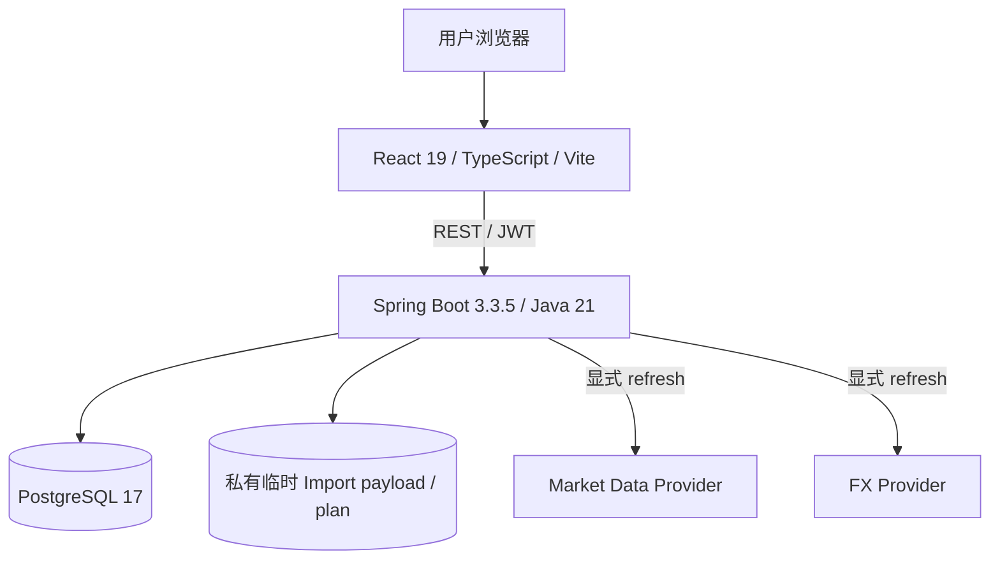
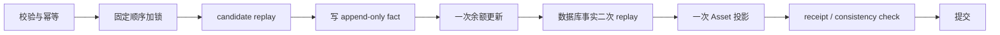

# Current Architecture

本文描述 `zh-cn` 当前实现。历史 v1.0 基线见 [Frozen Architecture](frozen-v1.0-architecture.md)，后续长期决策见 [ADR](../ADR/README.md)。当前阶段与验收状态见 [STATUS](../STATUS.md)。

## 1. 总体结构

Personal Finance OS 采用前后端分离的模块化单体：



- 前端负责交互、基础输入检查、状态恢复和服务端结果展示；
- 后端负责身份、业务规则、金融计算、事务、锁、幂等和聚合；
- PostgreSQL 保存用户财务事实、不可变审计记录和受控投影；
- Import 原文件与 frozen preview plan 使用服务端私有临时存储，取消、过期或提交后清理；
- 外部行情与 FX 只形成参考快照，不能修改账务真值。

## 2. 后端模块

后端入口包为 `com.financeos`，业务代码位于 `module/`。

| 模块 | 当前职责 | 主要依赖 |
| --- | --- | --- |
| `auth` / `user` | 注册、登录、JWT filter、BCrypt、当前 principal | common、users |
| `account` | Account CRUD、账户行锁、唯一余额变更原语 | user、PostgreSQL |
| `category` | 系统分类和用户分类 | user |
| `ledger` | 普通 Transaction CRUD、余额联动、duplicate probe | account、category |
| `asset` | Legacy Asset、Market Quote、FX、reference valuation | account、Provider boundary |
| `investment.instrument` | 用户级 Instrument 与 Position binding | account、asset |
| `investment.ledger` | calculator、canonical replay、trace 与 digest | 不依赖 HTTP |
| `investment.migration` | Legacy opening preview / confirm | account、instrument、ledger |
| `investment.command` | BUY / SELL / DIVIDEND、reversal、replacement | account、instrument、ledger、asset |
| `investment.read` | Portfolio、Position、logical transaction、audit timeline | asset、investment facts |
| `importing` | CSV/XLSX 解析、mapping、Preview、Confirm、Receipt、cleanup | ledger、account、category |
| `dashboard` | 用户财务概览聚合 | account、ledger、asset |
| `common` / `config` | 统一响应、异常、分页与应用配置 | 不承载业务规则 |

Controller 只处理 HTTP 边界；Service 负责业务编排与事务；Mapper 负责数据访问；DTO 隔离外部契约与持久化对象。

## 3. 前端结构

React 应用当前提供：

- `/` Dashboard；
- `/accounts`、`/assets`、`/transactions`；
- `/investments` 投资读取、命令与纠正工作区；
- `/transactions/import` 普通流水导入工作区；
- `/transactions/import/receipts/:batchId` 权威回执路由。

`src/api/` 封装 REST 调用，`src/hooks/` 编排投资与 Import 状态机，`src/components/` 提供可复用 UI。前端不重新计算余额、成本、PnL、duplicate evidence 或 Receipt digest。

Import Confirm 与 Receipt GET 使用 raw text + lossless JSON 解码，避免 JavaScript `Number` 破坏服务端金额精度。pending intent 只保存用户、Session/Batch、幂等键、path、精确 JSON body 与恢复状态，不保存文件、Preview rows、Receipt 或余额。

## 4. 数据真值

| 数据 | 角色 |
| --- | --- |
| `transactions` | 可更新/删除的普通财务事实；Import 也只通过正式写规则创建此类事实 |
| `Account.balance` | 与普通流水、Import、投资现金 effect 同事务维护的现金余额投影 |
| `investment_transactions` | append-only 投资事实与 posting-time receipt |
| `investment_transaction_corrections` | append-only replacement command envelope |
| transaction-driven `Asset` | canonical replay 后的当前 Position 投影 |
| `transaction_import_*` | Session 生命周期、committed Batch、Item 与 Account impact receipt evidence |
| `market_quotes` / `exchange_rates` | 共享参考快照，不是账务事实 |

详细 schema 见 [Database](database.md)，领域语义见 [domain](../domain/)。

## 5. 核心写路径

### 5.1 普通流水

```text
锁定旧 Transaction（更新/删除时）
→ 按 Account ID 升序锁定账户
→ 校验用户、Account、Category 与类型
→ 写普通 Transaction
→ 应用余额 delta
→ 提交
```

### 5.2 投资命令



Opening、BUY、SELL、DIVIDEND、standalone reversal 与 replacement 共用后端金融权威；replacement 采用 facts-first / command-last 和数据库 deferred integrity。

### 5.3 Transaction Import

```text
上传 CSV/XLSX
→ 私有 Session 与临时 payload
→ 显式 mapping
→ 服务端规范化、校验、duplicate warning
→ frozen PreviewPlan + signed token
→ Session FOR UPDATE
→ Account ID ascending locks
→ duplicate evidence recheck
→ 逐行写 Transaction
→ 聚合后一次/账户余额 delta
→ Batch + Items + Account Impacts + Session CONSUMED
→ 提交后清理临时 payload
```

Confirm 的所有金融事实和 Receipt evidence 位于同一 PostgreSQL 事务。详细规则见 [Transaction Import](../domain/transaction-import.md)。

## 6. 读取路径

- 基础列表使用 offset page/size 分页；
- Position 和 logical transaction 使用 opaque cursor seek pagination；
- 投资列表默认返回逻辑业务事件，不把 correction physical fact 当作独立业务交易；
- Portfolio 与 Position 当前值来自受控 `Asset` 投影；
- audit timeline 和 immutable receipt 表达历史，不替代当前投影；
- 普通 GET 不调用外部 Provider，也不获取金融写锁。

## 7. 安全与一致性

JWT principal 是 user ID。所有用户资源查询、锁定和写入同时包含 user ownership；跨用户与不存在保持安全 `404`。密码使用 BCrypt，生产 secret 必须外部注入。

事务、锁顺序、幂等与回滚见 [Consistency](consistency.md)；认证、文件解析和 Provider 边界见 [Security](security.md)。

## 8. 数据库与部署

- schema 由 Flyway V1–V17 前向迁移；
- PostgreSQL 特有的复合 FK、partial unique、trigger、deferred integrity、行锁和 `lock_timeout` 由 Testcontainers 验证；
- Docker Compose 描述 PostgreSQL → backend readiness → frontend health 的单机拓扑；
- production profile 关闭 OpenAPI / Swagger，只暴露 health。

当前 Compose 未传递 Import Confirm token secret，因而不能宣称现有标准 Compose 路径完整可运行。该已知不一致见 [Deployment](../engineering/deployment.md)。

## 9. 演进规则

- v1.0 Frozen Architecture 保持历史原文；
- 长期技术决策新增 ADR，不把 ADR 合并进本文件；
- 当前实现变化同步更新本文件、Database、API 和对应 domain 文档；
- 阶段设计与验收材料归档，不作为当前架构的替代来源；
- 不为 Roadmap 候选提前引入微服务、Redis、MQ、AI 或完整交易模型。
